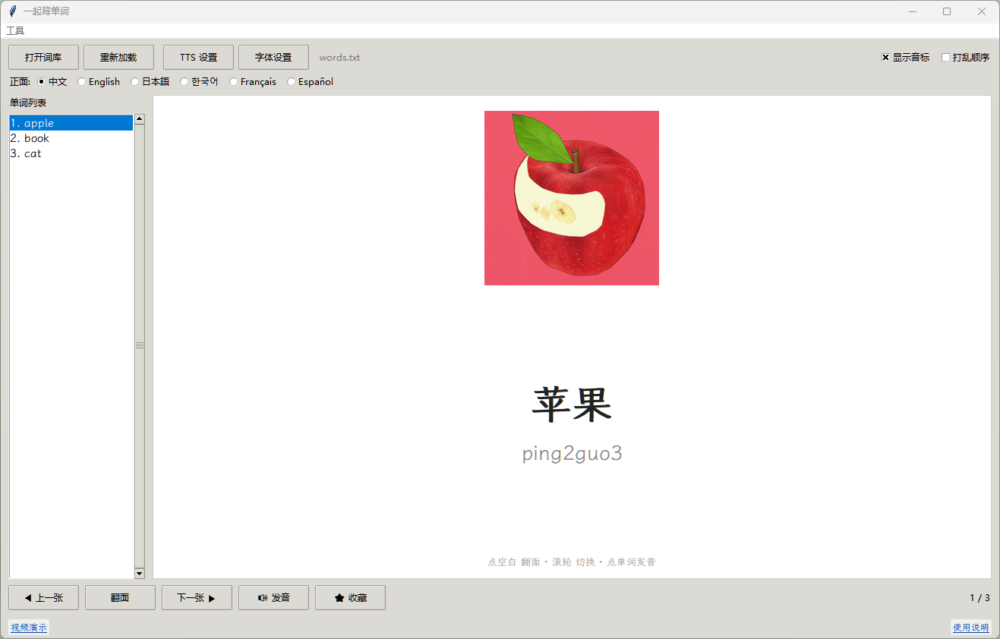

# Reciting_words_together / 一起背单词
[English](#english) | [中文](#chinese)

---

### 项目简介
包含中英日韩法西六国语言的单词记忆软件，支持自定义图片和单词发音。本项目界面、代码由DeepSeek Harness（DeepSeek-V4-Pro）辅助生成，由开发者手动调试、整合、优化并开源发布。

### 使用方法
1. 安装[Python](https://www.python.org/downloads/)（记得勾选 tcl/tk and IDLE）
2. 双击运行 `pip install.bat`安装所需依赖
3. 双击打开 `Reciting_ words_ together.py`
4. 运行程序：首先点击tts设置，发音引擎推荐Edge-TTS，除了左下角的那些按钮操作，也可以使用鼠标滚轮翻页，左键点击右侧空白处翻面，点击单词发音

[视频演示](https://www.bilibili.com/video/BV1isHS6REdd)

---

### Project Introduction
Contains word memory software in six languages of China, Britain, Japan, Korea, France and Spain, and supports custom pictures and word pronunciation.GUI and code of this project are assisted by DeepSeek Harness (DeepSeek-V4-Pro), manually debugged, integrated, optimized and open-sourced by the developer.

### Usage
1. Install [Python](https://www.python.org/downloads/) (remember to check tcl/tk and IDLE)
2. Double-click and run `pip install.bat` to install the required dependencies
3. Double-click to open `Reciting_ words_together.py`
4. Run the program: First click tts settings. The pronunciation engine recommends Edge-TTS. In addition to the button operations in the lower left corner, you can also use the mouse wheel to turn pages, left click on the blank space on the right side to turn over, and click on the word pronunciation

[Video Demonstration](https://www.bilibili.com/video/BV1isHS6REdd)
